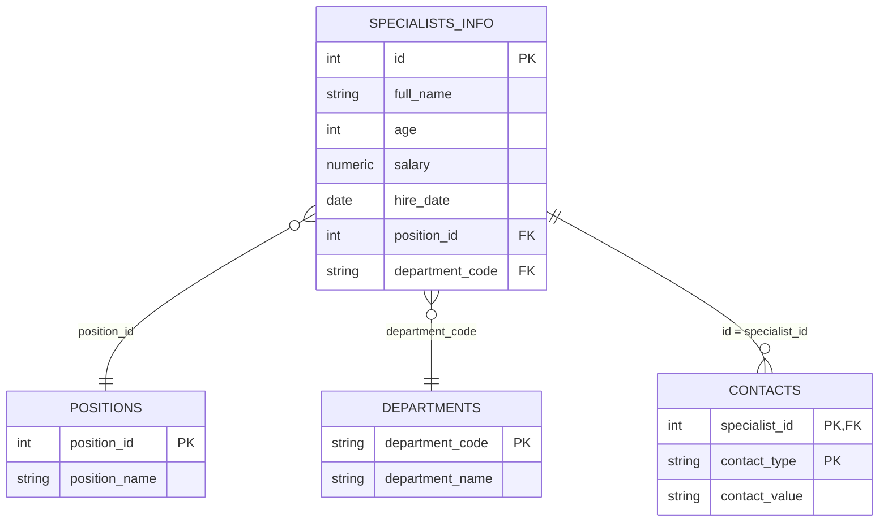

# Лабораторная работа №1
## Изучение принципов работы реляционной базы данных

**Вариант 1**

---

## 1. Цель работы

1. Изучить основные понятия о реляционных базах данных и принципы работы с ними.
2. Сформировать теоретические знания о понятии «отношение», его компонентах, а
   также практические навыки в области отражения объектов реального мира с
   помощью отношений реляционных баз данных.
3. Сформировать понятие ключа, изучить виды ключей, закрепить полученные
   знания на практике.

---

## 2. Краткие теоретические сведения

**База данных** — совокупность данных, организованных в соответствии с
концептуальной структурой, описывающей характеристики этих данных и
взаимоотношения между сущностями. **Реляционная база данных** хранит
информацию в виде связанных двумерных таблиц (отношений).

**Отношение** — множество кортежей (строк таблицы), обладающих одинаковым
набором атрибутов (столбцов). **Атрибут** — именованное свойство отношения
(столбец), **кортеж** — уникальная комбинация значений атрибутов (строка).

Над отношениями, рассматриваемыми как множества кортежей, выполняются
**теоретико-множественные операции**:

| Операция | Обозначение | Результат |
|---|---|---|
| Объединение | A ∪ B | все кортежи, принадлежащие A или B, без дублей |
| Пересечение | A ∩ B | кортежи, принадлежащие одновременно A и B |
| Разность | A – B | кортежи A, не принадлежащие B |
| Декартово произведение | A × B | все упорядоченные пары кортежей (a, b), a∈A, b∈B |

а также **специальные операции реляционной алгебры** (введены Э. Коддом):

- **Выборка (ограничение), Where** — отбирает кортежи, удовлетворяющие условию;
- **Проекция, Projection {…}** — формирует «вертикальное» подмножество
  отношения по указанным атрибутам, удаляя дубли строк;
- **Соединение** — операция, обратная проекции: объединяет кортежи двух
  отношений по условию;
- **Деление** — формирует отношение из кортежей R, соответствующих всем
  кортежам S.

**Ключи отношения:**

- **Потенциальный ключ** — атрибут (или набор атрибутов), однозначно
  идентифицирующий кортеж и претендующий на роль первичного ключа;
- **Первичный ключ (PK)** — выбранный из потенциальных ключей уникальный
  идентификатор кортежа; значения PK уникальны, не могут быть NULL, PK должен
  быть несократимым и минимальным;
- **Альтернативный ключ** — потенциальный ключ, не ставший первичным;
- **Простой / составной ключ** — состоит из одного / нескольких атрибутов;
- **Естественный ключ** — образован из уже существующих в предметной области
  атрибутов; **искусственный ключ** — специально введённый суррогатный
  идентификатор (например, счётчик `id`);
- **Внешний ключ (FK)** — атрибут, содержащий копию значений первичного ключа
  другого отношения, устанавливает связь между отношениями;
- **Рекурсивный ключ** — внешний ключ отношения, ссылающийся на первичный
  ключ того же самого отношения (например, поле «руководитель» в таблице
  сотрудников, ссылающееся на другого сотрудника этой же таблицы).

---

## 3. Задание 1 (Вариант 1)

### 3.1 Исходные отношения

**Отношение A**

| Страна | Столица |
|---|---|
| Армения | Ереван |
| Азербайджан | Баку |
| Беларусь | Минск |
| Грузия | Тбилиси |
| Казахстан | Астана |
| Кыргызстан | Бишкек |

**Отношение B**

| Страна | Столица |
|---|---|
| Грузия | Тбилиси |
| Казахстан | Астана |
| Кыргызстан | Бишкек |
| Латвия | Рига |
| Литва | Вильнюс |
| Молдова | Кишинев |
| Россия | Москва |
| Таджикистан | Душанбе |
| Туркменистан | Ашхабад |
| Узбекистан | Ташкент |

**Отношение C**

| Страна | Столица |
|---|---|
| Грузия | Тбилиси |
| Казахстан | Астана |
| Кыргызстан | Бишкек |
| Латвия | Рига |
| Узбекистан | Ташкент |
| Украина | Киев |
| Эстония | Таллин |
| Молдова | Кишенев |

### 3.2 Условие задания

```
(C – B) ∪ A
M = A Where A.col_1 = «выбрать первые два элемента»
N = B Where B.col_1 = «выбрать последние два элемента»
(M × N) Projection {A.col_1, B.col_1}
```

### 3.3 Выполнение операции (C – B) ∪ A

**Шаг 1. Разность C – B**

Сравнение проводится по кортежу целиком (Страна, Столица). Кортежи
«Грузия–Тбилиси», «Казахстан–Астана», «Кыргызстан–Бишкек», «Латвия–Рига»,
«Узбекистан–Ташкент» присутствуют в B — исключаются из результата.
Кортеж «Молдова–Кишенев» в отношении C не совпадает с кортежем
«Молдова–Кишинев» из B (различаются написанием столицы), поэтому
рассматривается как отсутствующий в B и остаётся в результате.

| Страна | Столица |
|---|---|
| Украина | Киев |
| Эстония | Таллин |
| Молдова | Кишенев |

**Шаг 2. Объединение (C – B) ∪ A**

Пересечений по кортежам между результатом шага 1 и отношением A нет, поэтому
итоговое отношение содержит все строки обоих множеств:

| Страна | Столица |
|---|---|
| Украина | Киев |
| Эстония | Таллин |
| Молдова | Кишенев |
| Армения | Ереван |
| Азербайджан | Баку |
| Беларусь | Минск |
| Грузия | Тбилиси |
| Казахстан | Астана |
| Кыргызстан | Бишкек |

### 3.4 Выполнение M, N и (M×N) Projection {A.col_1, B.col_1}

**M = A Where A.col_1 = «выбрать первые два элемента»** — выбираем первые две
строки отношения A:

| A.col_1 (Страна) | A.col_2 (Столица) |
|---|---|
| Армения | Ереван |
| Азербайджан | Баку |

**N = B Where B.col_1 = «выбрать последние два элемента»** — выбираем
последние две строки отношения B:

| B.col_1 (Страна) | B.col_2 (Столица) |
|---|---|
| Туркменистан | Ашхабад |
| Узбекистан | Ташкент |

**M × N** — декартово произведение (2 × 2 = 4 кортежа), затем **Projection
{A.col_1, B.col_1}** — оставляем только столбцы «страна из M» и «страна из N»,
удаляя дубли строк (в данном случае дублей нет):

| A.col_1 | B.col_1 |
|---|---|
| Армения | Туркменистан |
| Армения | Узбекистан |
| Азербайджан | Туркменистан |
| Азербайджан | Узбекистан |

Это итоговый результат задания 1.

---

## 4. Предметная область «Организация, в которой я работаю»

**Предметная область:** ИТ-служба (отдел информационных технологий)
организации, отвечающая за обслуживание компьютерной техники и программного
обеспечения сотрудников.

**Структура:** отдел состоит из нескольких групп специалистов (системные
администраторы, специалисты технической поддержки, программисты), каждый
специалист закреплён за определённым подразделением.

**Виды работ:** плановое обслуживание техники, устранение заявок пользователей
(инцидентов), настройка и внедрение программного обеспечения, консультации
сотрудников.

**Исполнители:** сотрудники ИТ-службы — специалисты различной квалификации и
должности, каждый из которых обладает набором контактных данных, датой приёма
на работу, возрастом, окладом и закреплён за конкретной должностью и
подразделением.

---

## 5. Отношение A — «Specialists» (Специалисты ИТ-службы)

### 5.1 Схема отношения

| Атрибут | Тип данных | Домен | Ограничения |
|---|---|---|---|
| `id` | числовой (INTEGER) | идентификаторы специалистов | уникальность, NOT NULL |
| `full_name` | символьный (VARCHAR) | ФИО сотрудников | NOT NULL |
| `age` | числовой (INTEGER) | возраст сотрудников (18–70) | NOT NULL |
| `salary` | числовой (NUMERIC) | оклад сотрудников (руб.) | NOT NULL, > 0 |
| `hire_date` | дата/время (DATE) | даты приёма на работу | NOT NULL |
| `position` | символьный (VARCHAR) | наименования должностей | NOT NULL |
| `department` | символьный (VARCHAR) | наименования подразделений | NOT NULL |
| `email` | символьный (VARCHAR) | корпоративные e-mail адреса | уникальность, NOT NULL |
| `phone` | символьный (VARCHAR) | номера телефонов | уникальность, NOT NULL |

Отношение удовлетворяет требованиям задания:

- количество атрибутов — 9 (≥ 5);
- количество кортежей — 7;
- присутствуют типы данных: числовой, символьный, дата/время;
- набор значений каждого атрибута образует отдельный домен;
- три различных домена с одинаковым (числовым) типом данных: `id`, `age`,
  `salary` — по смыслу это разные домены (идентификаторы, возраст, оклад), хотя
  оба хранятся как числа и напрямую не сопоставимы.

### 5.2 Данные отношения A

| id | full_name | age | salary | hire_date | position | department | email | phone |
|---|---|---|---|---|---|---|---|---|
| 1 | Иванов Пётр Сергеевич | 34 | 85000 | 2018-03-12 | Системный администратор | Отдел ИТ | ivanov.ps@company.ru | +7-916-100-01-01 |
| 2 | Смирнова Анна Викторовна | 29 | 72000 | 2020-06-01 | Специалист техподдержки | Отдел ИТ | smirnova.av@company.ru | +7-916-100-01-02 |
| 3 | Кузнецов Дмитрий Олегович | 41 | 95000 | 2015-01-20 | Программист | Отдел разработки | kuznetsov.do@company.ru | +7-916-100-01-03 |
| 4 | Фёдорова Мария Игоревна | 26 | 68000 | 2021-09-15 | Специалист техподдержки | Отдел ИТ | fedorova.mi@company.ru | +7-916-100-01-04 |
| 5 | Попов Алексей Николаевич | 38 | 90000 | 2016-11-03 | Руководитель отдела ИТ | Отдел ИТ | popov.an@company.ru | +7-916-100-01-05 |
| 6 | Соколова Елена Андреевна | 31 | 78000 | 2019-04-22 | Программист | Отдел разработки | sokolova.ea@company.ru | +7-916-100-01-06 |
| 7 | Никитин Роман Валерьевич | 45 | 88000 | 2013-07-09 | Системный администратор | Отдел ИТ | nikitin.rv@company.ru | +7-916-100-01-07 |

---

## 6. Естественные и искусственные ключи. Рекурсивный ключ

**Естественный ключ** (например, `email` или `phone` в отношении A):

- *достоинства:* имеет смысловое значение для предметной области, не требует
  дополнительного порождения значений;
- *недостатки:* может изменяться (сотрудник сменил телефон/почту), может быть
  составным и громоздким, иногда данные ещё не известны на момент создания
  записи.

**Искусственный ключ** (например, `id`):

- *достоинства:* никогда не изменяется, компактен (обычно одно число),
  упрощает построение внешних ключей и индексов, ускоряет поиск и соединение
  таблиц;
- *недостатки:* не несёт смысловой нагрузки, требует отдельного механизма
  генерации (счётчика), не защищает от логических дублей записей (если не
  добавить дополнительно уникальный естественный ключ).

**Рекурсивный ключ** — внешний ключ отношения, ссылающийся на первичный ключ
этого же отношения. Пример: если в отношение `Specialists` добавить атрибут
`manager_id` (руководитель), который ссылается на `id` этого же отношения, то
`manager_id` будет рекурсивным внешним ключом — так можно указать, кто из
специалистов является руководителем для другого специалиста этого же отдела.

---

## 7. Доработка отношения A: не менее трёх потенциальных ключей

В отношении `Specialists` выделены три потенциальных ключа (любой из них мог
бы быть выбран первичным):

1. `id` — искусственный простой ключ;
2. `email` — естественный простой ключ (уникален, NOT NULL);
3. `phone` — естественный простой ключ (уникален, NOT NULL).

В качестве первичного ключа выбран `id` (искусственный ключ) как самый
устойчивый к изменениям; `email` и `phone` являются альтернативными ключами.

---

## 8. Отношения-проекции

Из отношения `Specialists` выделены 4 отношения-проекции с учётом устранения
избыточности (повторения наименований должностей и подразделений) — по
аналогии с примером Soviet_movies → Soviet_movies_inf / Movies_adress /
Directors из теоретической части.

### 8.1 Specialists_info (основная информация о сотруднике)

| Атрибут | Тип | Ключ |
|---|---|---|
| `id` | числовой | **PK**, искусственный, простой |
| `full_name` | символьный | — |
| `age` | числовой | — |
| `salary` | числовой | — |
| `hire_date` | дата/время | — |
| `position_id` | числовой | **FK** → Positions.position_id |
| `department_code` | символьный | **FK** → Departments.department_code |

### 8.2 Positions (должности)

| Атрибут | Тип | Ключ |
|---|---|---|
| `position_id` | числовой | **PK**, искусственный, простой |
| `position_name` | символьный | уникальность, NOT NULL |

### 8.3 Departments (подразделения)

| Атрибут | Тип | Ключ |
|---|---|---|
| `department_code` | символьный (например, «IT», «DEV») | **PK**, естественный, простой |
| `department_name` | символьный | уникальность, NOT NULL |

### 8.4 Contacts (контактные данные)

| Атрибут | Тип | Ключ |
|---|---|---|
| `specialist_id` | числовой | **PK (часть составного)**, **FK** → Specialists_info.id |
| `contact_type` | символьный («email» / «phone») | **PK (часть составного)** |
| `contact_value` | символьный | уникальность, NOT NULL |

Ключ `(specialist_id, contact_type)` — **естественный составной ключ**: без
знания обоих атрибутов однозначно определить строку невозможно, а сама
комбинация возникает из природы предметной области (у одного специалиста
может быть запись и по email, и по телефону).

### Итог по видам первичных ключей отношений-проекций

| Отношение | Тип первичного ключа |
|---|---|
| Specialists_info | искусственный, простой (`id`) |
| Positions | искусственный, простой (`position_id`) |
| Departments | естественный, простой (`department_code`) |
| Contacts | естественный, составной (`specialist_id` + `contact_type`) |

---

## 9. Схема структуры базы данных



---

## 10. Выводы

В ходе выполнения лабораторной работы были изучены теоретические основы
реляционной модели данных: понятия отношения, атрибута, кортежа, домена, а
также теоретико-множественные (объединение, пересечение, разность, декартово
произведение) и специальные (выборка, проекция) операции реляционной алгебры.

На практике для варианта 1 были выполнены операции над отношениями «страна —
столица»: вычислена разность и объединение отношений, выполнены выборка,
декартово произведение и проекция, что позволило закрепить понимание порядка
и приоритета выполнения операций реляционной алгебры.

Также было смоделировано отношение, описывающее предметную область
«ИТ-служба организации», на его основе продемонстрированы понятия
потенциального, первичного, альтернативного, естественного, искусственного,
простого, составного и рекурсивного ключей. Путём декомпозиции исходного
отношения на четыре связанных отношения-проекции устранена избыточность
данных (повторение наименований должностей и подразделений) и показаны
примеры первичных ключей всех трёх типов: искусственного, естественного
простого и естественного составного, а также построена схема получившейся
базы данных с указанием первичных и внешних ключей.
