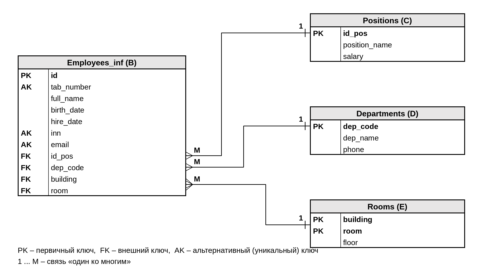

Министерство науки и высшего образования Российской Федерации

Федеральное государственное бюджетное образовательное учреждение высшего
образования

«Российский государственный университет имени А.Н. Косыгина

(Технологии. Дизайн. Искусство)»

Институт химических технологий и промышленной экологии

Кафедра энергоресурсоэффективных технологий, промышленной экологии и
безопасности

**ОТЧЕТ**

по лабораторной работе №1

по дисциплине «Информационные системы и базы данных»

на тему «Изучение принципов работы реляционной базы данных»

Вариант 1

> Выполнил: студент группы \_\_\_\_\_\_\_\_
>
> \_\_\_\_\_\_\_\_\_\_\_\_\_\_\_ / \_\_\_\_\_\_\_\_\_\_\_\_\_\_\_\_
>
> Проверил: \_\_\_\_\_\_\_\_\_\_\_\_\_\_\_\_\_\_\_\_\_\_
>
> \_\_\_\_\_\_\_\_\_\_\_\_\_\_\_ / \_\_\_\_\_\_\_\_\_\_\_\_\_\_\_\_

Москва 2026

**1 Цель работы**

Целью работы является изучение основных понятий реляционных баз данных и
принципов работы с ними. В ходе работы необходимо получить теоретические
знания о понятии «отношение» и его компонентах, а также практические
навыки отражения объектов реального мира с помощью отношений реляционной
базы данных. Кроме того, требуется сформировать понятие ключа, изучить
виды ключей и закрепить полученные знания на практике.

**2 Краткие теоретические сведения**

Базой данных называют совокупность данных, организованных в соответствии
с концептуальной структурой, которая описывает характеристики этих
данных и связи между сущностями предметной области. Для хранения и
обработки данных используются системы управления базами данных (СУБД),
например PostgreSQL, MySQL, MS SQL Server, Oracle и SQLite. В
реляционных базах данных информация хранится в виде двумерных таблиц,
которые спроектированы и связаны между собой по определенным правилам
\[2, 3\].

Основным понятием реляционной модели является отношение. Отношение
представляет собой множество кортежей, обладающих одинаковым набором
атрибутов. Если сравнивать с обычной таблицей, то отношению
соответствует таблица, кортежу соответствует строка, а атрибуту
соответствует столбец. Заголовок отношения вместе с характеристиками
атрибутов (типами данных, ограничениями) образует схему отношения.

Тип данных определяет множество допустимых значений, набор операций над
ними и способ записи значений. Доменом называют набор всех возможных
значений конкретного атрибута. Два атрибута могут иметь одинаковый тип
данных, но относиться к разным доменам. Например, год выпуска фильма и
номер ячейки хранения оба являются числами, но сравнивать их между собой
не имеет смысла.

Над отношениями выполняются операции реляционной алгебры. К
теоретико-множественным операциям относятся объединение, пересечение,
разность и декартово произведение. Результат объединения A ∪ B содержит
все кортежи, которые входят хотя бы в одно из отношений, причем
повторяющиеся кортежи не дублируются. Пересечение A ∩ B содержит только
кортежи, общие для обоих отношений. Разность A − B содержит кортежи
отношения A, которых нет в отношении B, и в общем случае не совпадает с
разностью B − A. Декартово произведение A × B состоит из всех возможных
пар кортежей, в которых первый кортеж берется из A, а второй из B.

Э. Кодд дополнил эти операции четырьмя специальными: выборкой
(ограничением), проекцией, соединением и делением. Выборка отбирает
кортежи отношения, которые удовлетворяют условию, записанному после
слова Where. Проекция строит новое отношение только из указанных
атрибутов исходного и при этом исключает повторяющиеся кортежи.
Соединение образует отношение из пар кортежей двух отношений,
удовлетворяющих заданному условию, а деление выделяет кортежи одного
отношения, которые сочетаются со всеми кортежами другого \[3\].

Для однозначной идентификации кортежей используются ключи. Потенциальным
ключом называют атрибут или набор атрибутов, который мог бы стать
первичным ключом. Первичный ключ (Primary Key, PK) выбирается из
потенциальных ключей. Его значения уникальны и не могут быть пустыми
(NULL), а сам ключ должен быть несократимым и минимальным. Потенциальные
ключи, которые не стали первичными, называют альтернативными. Ключ из
одного атрибута называют простым, ключ из нескольких атрибутов называют
составным.

Естественный ключ образуется из атрибутов, которые уже есть в предметной
области. Искусственный ключ вводится специально для удобства работы с
данными, чаще всего в виде счетчика id. Внешний ключ (Foreign Key, FK)
представляет собой атрибут или группу атрибутов, которые содержат копии
значений первичного ключа другого отношения и служат для связи отношений
между собой.

**3 Результаты выполнения работы**

В данном разделе описано выполнение каждого пункта порядка выполнения
лабораторной работы. Номер подраздела соответствует номеру пункта в
методических указаниях.

**3.1 Пункт 1. Изучение теоретических сведений**

Были изучены теоретические сведения, приведенные в методическом пособии.
Рассмотрены понятия базы данных, СУБД, отношения, кортежа, атрибута,
типа данных и домена, теоретико-множественные и специальные операции
реляционной алгебры, а также виды ключей: потенциальный, первичный,
альтернативный, простой, составной, естественный, искусственный и
внешний. Краткое изложение этих сведений приведено в разделе 2 отчета.

**3.2 Пункт 2. Требования к отношениям для применения реляционных
операций**

По источникам \[2, 3\] были изучены требования, которые предъявляются к
отношениям при выполнении реляционных операций.

Во-первых, любое отношение должно обладать общими свойствами. В нем не
может быть одинаковых кортежей, кортежи не упорядочены сверху вниз,
атрибуты не упорядочены слева направо, а каждое значение атрибута
атомарно, то есть не делится на части с точки зрения модели данных.

Во-вторых, для объединения, пересечения и разности отношения должны быть
совместимы по объединению (совместимы по типу). Это означает, что
отношения имеют одинаковое количество атрибутов, а соответствующие
атрибуты имеют одинаковые имена и определены на одних и тех же доменах.
Если это условие не выполняется, результат операции не будет корректным
отношением.

В-третьих, для декартова произведения совместимость по объединению не
нужна, но в заголовках отношений не должно быть атрибутов с одинаковыми
именами. Если имена совпадают, их уточняют именем отношения, например
A.col_1 и B.col_1. Заголовок результата включает все атрибуты обоих
отношений, а количество кортежей равно произведению количеств кортежей
исходных отношений.

В-четвертых, условие выборки может содержать только атрибуты данного
отношения, константы, операции сравнения и логические связки AND, OR,
NOT. При проекции можно указывать только те атрибуты, которые входят в
заголовок исходного отношения.

Из свойства неупорядоченности кортежей следует важный вывод для задания:
формулировки вида «первые два элемента» в реляционной алгебре нужно
записывать как явное условие на значения атрибутов.

**3.3 Пункт 3. Выполнение заданий по варианту и доработка отношений**

Согласно таблице А.1 методических указаний для варианта 1 выполняется
задание 1. Исходные отношения A, B и C приведены в таблицах 1, 2 и 3.
Атрибут «Страна» обозначен как col_1, атрибут «Столица» обозначен как
col_2.

Таблица 1 – Отношение A

| **col_1 (Страна)** | **col_2 (Столица)** |
|--------------------|---------------------|
| Армения            | Ереван              |
| Азербайджан        | Баку                |
| Беларусь           | Минск               |
| Грузия             | Тбилиси             |
| Казахстан          | Астана              |
| Кыргызстан         | Бишкек              |

Таблица 2 – Отношение B

| **col_1 (Страна)** | **col_2 (Столица)** |
|--------------------|---------------------|
| Грузия             | Тбилиси             |
| Казахстан          | Астана              |
| Кыргызстан         | Бишкек              |
| Латвия             | Рига                |
| Литва              | Вильнюс             |
| Молдова            | Кишинев             |
| Россия             | Москва              |
| Таджикистан        | Душанбе             |
| Туркменистан       | Ашхабад             |
| Узбекистан         | Ташкент             |

Таблица 3 – Отношение C

| **col_1 (Страна)** | **col_2 (Столица)** |
|--------------------|---------------------|
| Грузия             | Тбилиси             |
| Казахстан          | Астана              |
| Кыргызстан         | Бишкек              |
| Латвия             | Рига                |
| Узбекистан         | Ташкент             |
| Украина            | Киев                |
| Эстония            | Таллин              |
| Молдова            | Кишенев             |

Задание 1 включает следующие операции:

*(C − B) ∪ A*

*M = A Where A.col_1 = «выбрать первые два элемента»*

*N = B Where B.col_1 = «выбрать последние два элемента»*

*(M × N) Projection {A.col_1, B.col_1}*

Перед выполнением операций отношения были проверены на соответствие
требованиям из пункта 2. Все три отношения имеют одинаковый заголовок из
двух атрибутов col_1 и col_2 символьного типа. Атрибут col_1 во всех
отношениях определен на домене названий стран, а атрибут col_2 на домене
названий столиц. Следовательно, отношения A, B и C совместимы по
объединению, и к ним можно применять объединение и разность.

Для выполнения декартова произведения отношения были доработаны: имена
атрибутов уточнены именами исходных отношений (A.col_1, A.col_2,
B.col_1, B.col_2), чтобы в заголовке результата не было одинаковых имен.

Так как кортежи в отношении не упорядочены, условия выборки были
записаны в явном виде через значения атрибута col_1. За порядок
элементов принят порядок строк, в котором отношения даны в варианте:

*M = A Where A.col_1 = 'Армения' OR A.col_1 = 'Азербайджан'*

*N = B Where B.col_1 = 'Туркменистан' OR B.col_1 = 'Узбекистан'*

Также при проверке данных было замечено, что в отношении C столица
Молдовы записана как «Кишенев», а в отношении B как «Кишинев». Кортежи
сравниваются по значениям всех атрибутов, поэтому формально это два
разных кортежа. Исходные данные варианта не изменялись, и это различие
было учтено при вычислении разности.

**3.4 Пункт 4. Результаты выполнения операций над отношениями**

Операции выполнялись с учетом приоритета: сначала выполнялись действия в
скобках, затем остальные операции.

***Операция (C − B) ∪ A***

Сначала вычислена разность C − B. Из отношения C исключаются кортежи,
которые есть в отношении B: «Грузия, Тбилиси», «Казахстан, Астана»,
«Кыргызстан, Бишкек», «Латвия, Рига» и «Узбекистан, Ташкент». Кортежей
«Украина, Киев» и «Эстония, Таллин» в отношении B нет. Кортеж «Молдова,
Кишенев» также остается, так как в B он записан с другим значением
столицы. Результат приведен в таблице 4.

Таблица 4 – Результат разности C − B

| **col_1 (Страна)** | **col_2 (Столица)** |
|--------------------|---------------------|
| Украина            | Киев                |
| Эстония            | Таллин              |
| Молдова            | Кишенев             |

Затем выполнено объединение полученного отношения с отношением A. Общих
кортежей у них нет, поэтому результат содержит все 3 кортежа разности и
все 6 кортежей отношения A, всего 9 кортежей (таблица 5).

Таблица 5 – Результат операции (C − B) ∪ A

| **col_1 (Страна)** | **col_2 (Столица)** |
|--------------------|---------------------|
| Украина            | Киев                |
| Эстония            | Таллин              |
| Молдова            | Кишенев             |
| Армения            | Ереван              |
| Азербайджан        | Баку                |
| Беларусь           | Минск               |
| Грузия             | Тбилиси             |
| Казахстан          | Астана              |
| Кыргызстан         | Бишкек              |

***Операции выборки M и N***

Отношение M получено выборкой из отношения A первых двух кортежей
(таблица 6), отношение N получено выборкой из отношения B последних двух
кортежей (таблица 7).

Таблица 6 – Отношение M = A Where A.col_1 = 'Армения' OR A.col_1 =
'Азербайджан'

| **A.col_1** | **A.col_2** |
|-------------|-------------|
| Армения     | Ереван      |
| Азербайджан | Баку        |

Таблица 7 – Отношение N = B Where B.col_1 = 'Туркменистан' OR B.col_1 =
'Узбекистан'

| **B.col_1**  | **B.col_2** |
|--------------|-------------|
| Туркменистан | Ашхабад     |
| Узбекистан   | Ташкент     |

***Операция (M × N) Projection {A.col_1, B.col_1}***

Сначала выполнено декартово произведение M × N. Каждый кортеж отношения
M соединяется с каждым кортежем отношения N, поэтому результат содержит
2 × 2 = 4 кортежа и четыре атрибута (таблица 8).

Таблица 8 – Результат декартова произведения M × N

| **A.col_1** | **A.col_2** | **B.col_1**  | **B.col_2** |
|-------------|-------------|--------------|-------------|
| Армения     | Ереван      | Туркменистан | Ашхабад     |
| Армения     | Ереван      | Узбекистан   | Ташкент     |
| Азербайджан | Баку        | Туркменистан | Ашхабад     |
| Азербайджан | Баку        | Узбекистан   | Ташкент     |

Затем к результату применена проекция на атрибуты A.col_1 и B.col_1, то
есть оставлены только названия стран из отношений M и N. Повторяющихся
кортежей в результате не оказалось, поэтому все четыре кортежа
сохранились (таблица 9).

Таблица 9 – Результат операции (M × N) Projection {A.col_1, B.col_1}

| **A.col_1** | **B.col_1**  |
|-------------|--------------|
| Армения     | Туркменистан |
| Армения     | Узбекистан   |
| Азербайджан | Туркменистан |
| Азербайджан | Узбекистан   |

**3.5 Пункт 5. Характеристика предметной области «Организация, в которой
я работаю»**

В качестве предметной области выбрана организация ООО «ТехноСервис». Это
сервисный центр, который занимается ремонтом и обслуживанием
компьютерной техники для частных клиентов и небольших компаний.

Организация состоит из четырех подразделений. Администрация отвечает за
общее руководство и работу с документами. Отдел приема заказов принимает
технику от клиентов, оформляет заказы и выдает готовые устройства.
Ремонтный отдел выполняет диагностику и ремонт техники. Отдел
технической поддержки консультирует клиентов, настраивает программное
обеспечение и выполняет выездное обслуживание.

Сервисный центр располагается в двух корпусах. В корпусе 1 находятся
кабинет директора и зона приема заказов, в корпусе 2 находятся
мастерская и помещение технической поддержки. Нумерация кабинетов в
корпусах своя, поэтому кабинет с одним и тем же номером может быть в
обоих корпусах.

Основные виды работ организации: прием и оформление заказов, диагностика
неисправностей, ремонт и замена комплектующих, установка и настройка
программного обеспечения, консультации клиентов.

Исполнителями работ являются сотрудники организации. У каждого
сотрудника есть табельный номер, фамилия, имя и отчество, дата рождения,
должность, подразделение, дата приема на работу, оклад и рабочее место
(корпус и номер кабинета).

**3.6 Пункт 6. Формирование отношения A**

На основе описания предметной области сформировано отношение A с именем
Employees (Сотрудники). Имя отношения и имена атрибутов записаны
латинскими буквами в соответствии с правилами именования из
методического пособия. Схема отношения приведена в таблице 10.

Таблица 10 – Схема отношения Employees

| **Атрибут** | **Описание**          | **Тип данных** | **Домен**                    |
|-------------|-----------------------|----------------|------------------------------|
| tab_number  | Табельный номер       | числовой       | табельные номера сотрудников |
| full_name   | ФИО сотрудника        | символьный     | фамилии, имена и отчества    |
| birth_date  | Дата рождения         | дата/время     | даты рождения сотрудников    |
| position    | Должность             | символьный     | наименования должностей      |
| department  | Подразделение         | символьный     | наименования подразделений   |
| hire_date   | Дата приема на работу | дата/время     | даты приема на работу        |
| salary      | Оклад, руб.           | числовой       | размеры окладов              |
| building    | Номер корпуса         | числовой       | номера корпусов              |
| room        | Номер кабинета        | числовой       | номера кабинетов             |

Отношение отвечает требованиям пункта 6. Количество атрибутов равно
девяти, что больше необходимых пяти. Количество кортежей равно семи
(данные приведены в пункте 8). В отношении присутствуют все три
требуемых типа данных: числовой (tab_number, salary, building, room),
символьный (full_name, position, department) и дата/время (birth_date,
hire_date). Набор значений каждого атрибута образует отдельный домен,
что показано в последнем столбце таблицы 10.

**3.7 Пункт 7. Наличие разных доменов с одинаковым типом данных**

В отношении Employees есть несколько групп атрибутов, у которых тип
данных одинаковый, а домены разные (таблица 11).

Таблица 11 – Домены с одинаковым типом данных

| **Тип данных** | **Атрибуты**                       | **Количество доменов** |
|----------------|------------------------------------|------------------------|
| числовой       | tab_number, salary, building, room | 4                      |
| символьный     | full_name, position, department    | 3                      |
| дата/время     | birth_date, hire_date              | 2                      |

Требование о наличии не менее трех разных доменов с одинаковым типом
данных выполнено. Например, атрибуты tab_number, salary, building и room
имеют числовой тип, но относятся к разным доменам. Сравнивать оклад
сотрудника с номером кабинета или табельный номер с номером корпуса
бессмысленно, хотя технически это числа. То же самое относится к
символьным атрибутам: наименование должности нельзя по смыслу сравнивать
с фамилией сотрудника.

**3.8 Пункт 8. Заполнение отношения данными**

Отношение Employees заполнено данными о семи сотрудниках организации
(таблица 12).

Таблица 12 – Данные отношения Employees

| **tab_number** | **full_name**              | **birth_date** | **position**               | **department**              | **hire_date** | **salary** | **buil- ding** | **room** |
|----------------|----------------------------|----------------|----------------------------|-----------------------------|---------------|------------|----------------|----------|
| 1001           | Соколов Андрей Викторович  | 14.03.1985     | Директор                   | Администрация               | 10.02.2015    | 120000     | 1              | 101      |
| 1002           | Лебедева Ольга Петровна    | 22.07.1990     | Менеджер по приему заказов | Отдел приема заказов        | 01.03.2017    | 65000      | 1              | 102      |
| 1003           | Морозов Игорь Сергеевич    | 05.11.1988     | Инженер по ремонту         | Ремонтный отдел             | 15.05.2016    | 80000      | 2              | 101      |
| 1004           | Волков Денис Алексеевич    | 30.01.1995     | Инженер по ремонту         | Ремонтный отдел             | 12.09.2019    | 80000      | 2              | 101      |
| 1005           | Павлова Екатерина Игоревна | 18.09.1993     | Специалист техподдержки    | Отдел технической поддержки | 03.04.2018    | 70000      | 2              | 205      |
| 1006           | Козлов Максим Олегович     | 09.06.1998     | Специалист техподдержки    | Отдел технической поддержки | 20.08.2021    | 70000      | 2              | 205      |
| 1007           | Новикова Анна Дмитриевна   | 27.12.1996     | Менеджер по приему заказов | Отдел приема заказов        | 14.01.2022    | 65000      | 1              | 102      |

**3.9 Пункт 9. Ограничения на значения атрибутов**

Для значений атрибутов отношения Employees определены самые очевидные
ограничения (таблица 13).

Таблица 13 – Ограничения на значения атрибутов отношения Employees

| **Атрибут** | **Ограничения**                                                                                                                    |
|-------------|------------------------------------------------------------------------------------------------------------------------------------|
| tab_number  | Значения уникальны, NULL не допускается, целое положительное число из четырех цифр                                                 |
| full_name   | NULL не допускается, значения могут повторяться (возможны однофамильцы и полные тезки)                                             |
| birth_date  | NULL не допускается, на дату приема на работу сотруднику должно быть не меньше 18 лет                                              |
| position    | NULL не допускается, значение выбирается из списка должностей организации                                                          |
| department  | NULL не допускается, значение выбирается из списка подразделений организации                                                       |
| hire_date   | NULL не допускается, дата не позже текущей и позже даты рождения                                                                   |
| salary      | NULL не допускается, значение больше нуля и не меньше МРОТ                                                                         |
| building    | NULL допускается (если у сотрудника нет постоянного рабочего места), значения 1 или 2                                              |
| room        | NULL допускается вместе с building, целое положительное число; пара (building, room) должна соответствовать существующему кабинету |

**3.10 Пункт 10. Оформление отчета**

Отчет о выполненной работе оформлен в соответствии с ГОСТ 7.32-2017 и
содержит все разделы, указанные в методических указаниях: цель работы,
краткие теоретические сведения, табличные и графические результаты
выполнения заданий с текстовыми пояснениями и выводы по работе. Пункты с
11 по 15 выполнены после оформления основной части и также включены в
отчет.

**3.11 Пункт 11. Естественные и искусственные ключи, рекурсивный ключ**

По источникам \[2, 3\] были изучены достоинства и недостатки
естественных и искусственных ключей. Результаты сравнения приведены в
таблице 14.

Таблица 14 – Сравнение естественных и искусственных ключей

| **Вид ключа** | **Достоинства**                                                                                                                                                                | **Недостатки**                                                                                                                                                                                                                            |
|---------------|--------------------------------------------------------------------------------------------------------------------------------------------------------------------------------|-------------------------------------------------------------------------------------------------------------------------------------------------------------------------------------------------------------------------------------------|
| Естественный  | Имеет смысл в предметной области и понятен пользователю. Не требует дополнительного атрибута. Сам по себе защищает от повторного ввода одного и того же объекта.               | Значение может измениться (например, сотрудник сменил адрес электронной почты), и тогда придется менять его во всех связанных отношениях. Часто бывает составным и громоздким. Значение может быть неизвестно в момент добавления записи. |
| Искусственный | Никогда не меняется. Компактен (обычно одно целое число). Упрощает создание внешних ключей и ускоряет поиск и соединение отношений. Значения легко генерировать автоматически. | Не несет смысловой нагрузки. Требует дополнительного атрибута и механизма генерации значений. Не защищает от дублирования данных, если дополнительно не задать уникальность естественных атрибутов.                                       |

Рекурсивным ключом называют внешний ключ, который ссылается на первичный
ключ того же самого отношения. Он используется, когда между объектами
одного типа есть связь, например иерархия подчинения.

Для отношения Employees пример рекурсивного ключа можно получить, если
добавить атрибут manager_number (табельный номер непосредственного
руководителя). Этот атрибут ссылается на tab_number того же отношения.
Например, у инженеров по ремонту Морозова И.С. (1003) и Волкова Д.А.
(1004) значение manager_number будет равно 1001, то есть их
руководителем является директор Соколов А.В. У самого директора значение
manager_number будет пустым (NULL), так как руководителя внутри
организации у него нет.

**3.12 Пункт 12. Доработка отношения A (не менее трех потенциальных
ключей)**

В исходном отношении Employees только один атрибут однозначно определяет
кортеж: табельный номер tab_number. Атрибут full_name ключом быть не
может, так как у разных сотрудников могут совпадать фамилия, имя и
отчество. Комбинация full_name и birth_date на практике почти всегда
уникальна, но гарантировать это нельзя.

Чтобы в отношении было не менее трех потенциальных ключей, в него
добавлены атрибуты id (искусственный идентификатор, счетчик), inn (ИНН
сотрудника, символьный тип, 12 цифр) и email (корпоративный адрес
электронной почты). Значения добавленных атрибутов приведены в таблице
15, остальные атрибуты не изменились и совпадают с таблицей 12.

Таблица 15 – Ключевые атрибуты доработанного отношения Employees

| **id** | **tab_number** | **full_name**              | **inn**      | **email**                 |
|--------|----------------|----------------------------|--------------|---------------------------|
| 1      | 1001           | Соколов Андрей Викторович  | 770112345601 | sokolov@technoservice.ru  |
| 2      | 1002           | Лебедева Ольга Петровна    | 770298765402 | lebedeva@technoservice.ru |
| 3      | 1003           | Морозов Игорь Сергеевич    | 503112233403 | morozov@technoservice.ru  |
| 4      | 1004           | Волков Денис Алексеевич    | 771044556604 | volkov@technoservice.ru   |
| 5      | 1005           | Павлова Екатерина Игоревна | 772566778805 | pavlova@technoservice.ru  |
| 6      | 1006           | Козлов Максим Олегович     | 500399887706 | kozlov@technoservice.ru   |
| 7      | 1007           | Новикова Анна Дмитриевна   | 773411223307 | novikova@technoservice.ru |

В результате отношение Employees имеет четыре потенциальных ключа: id
(искусственный простой ключ), tab_number, inn и email (естественные
простые ключи). Все они уникальны, не допускают NULL и являются
несократимыми, так как состоят из одного атрибута.

В качестве первичного ключа выбран id, поскольку его значение никогда не
меняется и удобно для организации связей. Атрибуты tab_number, inn и
email становятся альтернативными ключами, для них задается ограничение
уникальности.

**3.13 Пункт 13. Выделение отношений-проекций**

В таблице 12 видно, что в отношении Employees данные повторяются.
Наименование должности и оклад повторяются у всех сотрудников с
одинаковой должностью, наименование подразделения повторяется у всех
сотрудников отдела, а корпус и кабинет повторяются у сотрудников,
работающих в одном помещении. Чтобы убрать эту избыточность, из
отношения Employees выделены четыре проекции:

*B = Employees Projection {id, tab_number, full_name, birth_date,
hire_date, inn, email, position, department, building, room}*

*C = Employees Projection {position, salary}*

*D = Employees Projection {department}*

*E = Employees Projection {building, room}*

Отношениям даны имена: B получило имя Employees_inf (сведения о
сотрудниках), C получило имя Positions (должности), D получило имя
Departments (подразделения), E получило имя Rooms (кабинеты). Поскольку
проекция исключает повторяющиеся кортежи, в отношении Positions осталось
четыре кортежа, в Departments четыре, в Rooms четыре.

Отношения-проекции были дополнены атрибутами. В Positions добавлен код
должности id_pos, в Departments добавлены код подразделения dep_code и
внутренний телефон phone, в Rooms добавлен этаж floor. В отношении
Employees_inf атрибуты position и department заменены на id_pos и
dep_code, которые ссылаются на соответствующие отношения.

**3.14 Пункт 14. Первичные и внешние ключи отношений-проекций**

Для каждого отношения-проекции определен первичный ключ, а для отношения
Employees_inf также внешние ключи. Первичные ключи подобраны так, чтобы
в базе данных были представлены все три требуемых вида ключей.

В отношении Employees_inf первичным ключом является искусственный ключ
id. Внешние ключи id_pos, dep_code и пара (building, room) ссылаются на
отношения Positions, Departments и Rooms. Атрибуты birth_date,
hire_date, inn и email в таблице 16 не показаны, их значения совпадают с
таблицами 12 и 15.

Таблица 16 – Отношение Employees_inf (B)

| **id (PK)** | **tab_number** | **full_name**              | **id_pos (FK)** | **dep_code (FK)** | **building (FK)** | **room (FK)** |
|-------------|----------------|----------------------------|-----------------|-------------------|-------------------|---------------|
| 1           | 1001           | Соколов Андрей Викторович  | 1               | АДМ               | 1                 | 101           |
| 2           | 1002           | Лебедева Ольга Петровна    | 2               | ОПЗ               | 1                 | 102           |
| 3           | 1003           | Морозов Игорь Сергеевич    | 3               | РО                | 2                 | 101           |
| 4           | 1004           | Волков Денис Алексеевич    | 3               | РО                | 2                 | 101           |
| 5           | 1005           | Павлова Екатерина Игоревна | 4               | ОТП               | 2                 | 205           |
| 6           | 1006           | Козлов Максим Олегович     | 4               | ОТП               | 2                 | 205           |
| 7           | 1007           | Новикова Анна Дмитриевна   | 2               | ОПЗ               | 1                 | 102           |

В отношении Positions первичным ключом выбран искусственный ключ id_pos.
Наименование должности можно было бы сделать естественным ключом, но оно
длинное и может меняться при переименовании должностей.

Таблица 17 – Отношение Positions (C)

| **id_pos (PK)** | **position_name**          | **salary** |
|-----------------|----------------------------|------------|
| 1               | Директор                   | 120000     |
| 2               | Менеджер по приему заказов | 65000      |
| 3               | Инженер по ремонту         | 80000      |
| 4               | Специалист техподдержки    | 70000      |

В отношении Departments первичным ключом является естественный простой
ключ dep_code. Это краткое обозначение подразделения, которое
используется в документах организации, поэтому оно существует в самой
предметной области.

Таблица 18 – Отношение Departments (D)

| **dep_code (PK)** | **dep_name**                | **phone** |
|-------------------|-----------------------------|-----------|
| АДМ               | Администрация               | 100       |
| ОПЗ               | Отдел приема заказов        | 110       |
| РО                | Ремонтный отдел             | 210       |
| ОТП               | Отдел технической поддержки | 220       |

В отношении Rooms первичным ключом является естественный составной ключ
(building, room). Номер кабинета сам по себе не уникален: кабинет 101
есть и в корпусе 1, и в корпусе 2. Номер корпуса тоже не уникален.
Однозначно определить кабинет можно только по паре значений, и ни один
атрибут из этой пары убрать нельзя, поэтому ключ несократим.

Таблица 19 – Отношение Rooms (E)

| **building (PK)** | **room (PK)** | **floor** |
|-------------------|---------------|-----------|
| 1                 | 101           | 1         |
| 1                 | 102           | 1         |
| 2                 | 101           | 1         |
| 2                 | 205           | 2         |

Итоговые сведения о ключах всех отношений приведены в таблице 20.

Таблица 20 – Ключи отношений базы данных

| **Отношение** | **Первичный ключ** | **Вид первичного ключа** | **Внешние ключи**                  |
|---------------|--------------------|--------------------------|------------------------------------|
| Employees_inf | id                 | искусственный, простой   | id_pos, dep_code, (building, room) |
| Positions     | id_pos             | искусственный, простой   | нет                                |
| Departments   | dep_code           | естественный, простой    | нет                                |
| Rooms         | building, room     | естественный, составной  | нет                                |

**3.15 Пункт 15. Схема структуры базы данных**

Структура полученной базы данных изображена на рисунке 1. Для каждого
отношения указаны заголовок (имена атрибутов) и свойства атрибутов:
первичный ключ (PK), внешний ключ (FK) и альтернативный ключ с
ограничением уникальности (AK).

Рисунок 1 – Структура базы данных организации ООО «ТехноСервис»

Все связи в базе данных имеют тип «один ко многим». Одной должности из
отношения Positions может соответствовать несколько сотрудников, но у
каждого сотрудника только одна должность. Точно так же в одном
подразделении работает несколько сотрудников, и в одном кабинете могут
работать несколько сотрудников. Связь с отношением Rooms выполняется по
составному внешнему ключу (building, room).

**4 Выводы**

В ходе лабораторной работы были изучены основные понятия реляционной
модели данных: отношение, кортеж, атрибут, тип данных и домен, а также
операции реляционной алгебры и требования, которые предъявляются к
отношениям для их выполнения.

Для варианта 1 выполнено задание 1. Результат операции (C − B) ∪ A
содержит девять кортежей. При вычислении разности выяснилось, что
кортежи сравниваются по всем атрибутам, поэтому из-за разного написания
столицы Молдовы кортеж «Молдова, Кишенев» попал в результат. Результат
операции (M × N) Projection {A.col_1, B.col_1} содержит четыре пары
стран. Также на практике стало понятно, что из-за неупорядоченности
кортежей условия вида «первые два элемента» нужно записывать через
конкретные значения атрибутов.

Для предметной области сервисного центра ООО «ТехноСервис» было
сформировано отношение Employees из девяти атрибутов и семи кортежей,
для атрибутов определены домены и ограничения. После доработки отношение
получило четыре потенциальных ключа, из которых первичным выбран
искусственный ключ id.

Разбиение исходного отношения на четыре проекции Employees_inf,
Positions, Departments и Rooms позволило избавиться от повторения данных
о должностях, подразделениях и кабинетах. В полученной базе данных
использованы все три вида первичных ключей: искусственный, естественный
простой и естественный составной, а связи между отношениями организованы
с помощью внешних ключей.

**СПИСОК ИСПОЛЬЗОВАННЫХ ИСТОЧНИКОВ**

1\. PostgreSQL: официальный сайт. URL: https://www.postgresql.org (дата
обращения: 24.09.2026).

2\. Дейт К.Дж. Введение в системы баз данных. 8-е изд. М.: Вильямс,
2005. 1328 с.

3\. Коннолли Т., Бегг К. Базы данных. Проектирование, реализация и
сопровождение. Теория и практика. 3-е изд. М.: Вильямс, 2003. 1440 с.

4\. Информационные системы и базы данных. Лабораторные работы:
методические указания. М.: РГУ им. А.Н. Косыгина, 2026.
